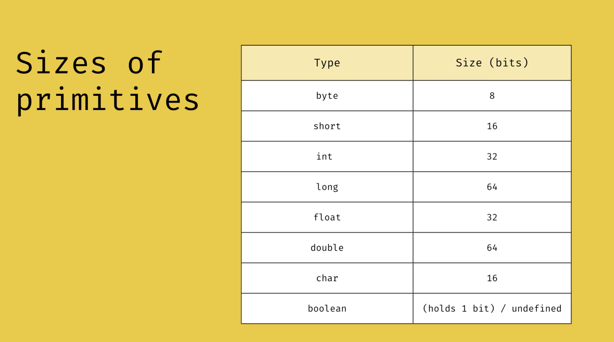

<ul>
    <li>Primitive Types: Are for storing values directly</li>
    <li>------------------------------------------------</li>
    <li>Byte: -128 to 127</li>
    <li>short -32768 to 32767</li>
    <li>int: -2^31 to 2^31-1</li>
    <li>long: -2^63 to 2^63-1</li>
    <li>------------------------------------------------</li>
    <li>float: For floating point numbers - EX. 3.2</li>
    <li>double</li>
    <li>char: holds a unicode character and can also hold a numeric value but it will translate that to the corresponding unicode character</li>
    <li>boolean: 1 and 0 </li>
</ul>

